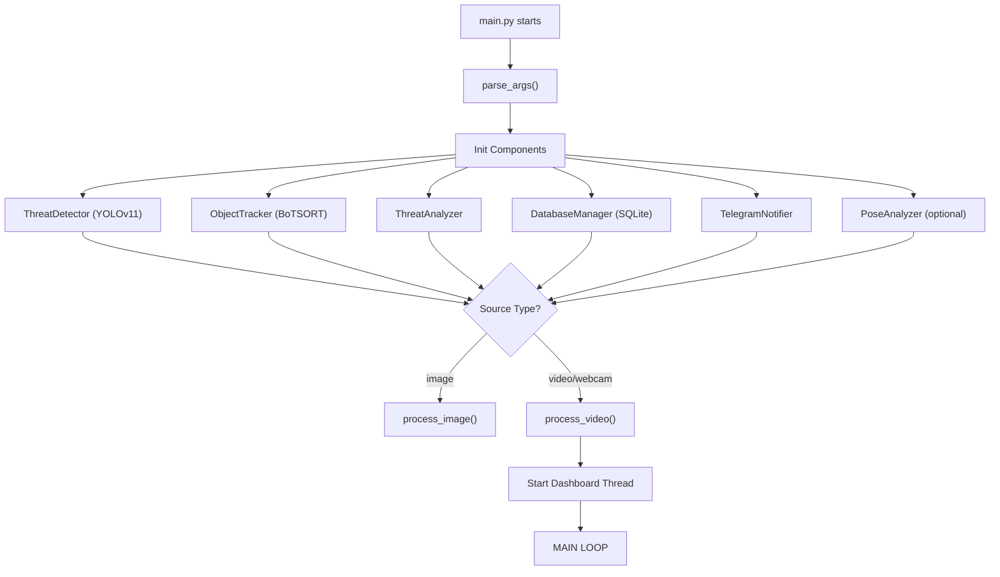
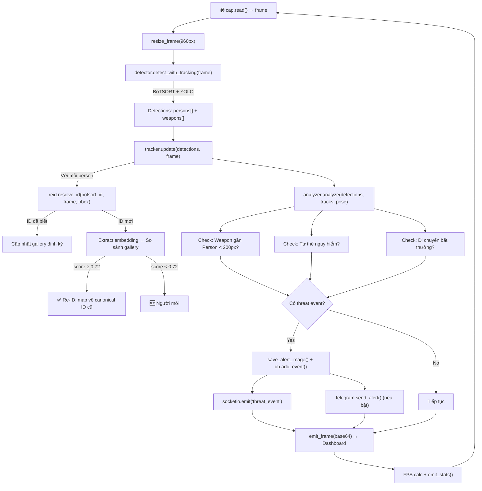

# 🛡️ AI Security Monitor — Tài Liệu Hệ Thống

> **Hệ thống phát hiện kẻ nguy hiểm sử dụng AI (YOLOv11 + BoTSORT Re-ID + Telegram)**

---

## 📌 Tổng Quan

Hệ thống giám sát an ninh real-time, phát hiện **người** và **vũ khí** (dao, kéo) từ camera/video, theo dõi đối tượng xuyên suốt, phân tích mối đe dọa, và gửi cảnh báo qua Telegram + Web Dashboard.

### Tech Stack

| Thành phần | Công nghệ |
|---|---|
| **Detection** | YOLOv11s (Ultralytics) |
| **Tracking** | BoTSORT (built-in Ultralytics) |
| **Re-ID** | OSNet x0_25 (torchreid) / MobileNetV3 fallback |
| **Pose** | YOLOv11s-Pose |
| **Dashboard** | Flask + Flask-SocketIO (WebSocket) |
| **Database** | SQLite3 |
| **Notification** | Telegram Bot API |
| **Frontend** | Vanilla JS + Canvas + Socket.IO |

---

## 🏗️ Kiến Trúc Hệ Thống

```
┌──────────────────────────────────────────────────────────┐
│                      main.py (Entry Point)               │
│  parse_args() → init components → process_video/image    │
└──────┬──────────┬──────────┬──────────┬─────────┬────────┘
       │          │          │          │         │
       ▼          ▼          ▼          ▼         ▼
  ┌─────────┐ ┌────────┐ ┌────────┐ ┌──────┐ ┌────────┐
  │Detector │ │Tracker │ │Threat  │ │ DB   │ │Telegram│
  │(YOLOv11)│ │(BoTSORT│ │Analyzer│ │Mgr   │ │Notifier│
  │         │ │+Re-ID) │ │        │ │      │ │        │
  └────┬────┘ └───┬────┘ └───┬────┘ └──┬───┘ └───┬────┘
       │          │          │         │         │
       │     ┌────┴────┐    │         │         │
       │     │ReID     │    │         │         │
       │     │Gallery  │    │         │         │
       │     │(OSNet)  │    │         │         │
       │     └─────────┘    │         │         │
       │                    │         │         │
       ▼                    ▼         ▼         ▼
  ┌──────────────────────────────────────────────────┐
  │              Dashboard (Flask + SocketIO)         │
  │  ┌──────────┐  ┌───────────┐  ┌───────────────┐ │
  │  │index.html│  │dashboard.js│  │  style.css    │ │
  │  │(Canvas)  │  │(Socket.IO) │  │  (Dark Theme) │ │
  │  └──────────┘  └───────────┘  └───────────────┘ │
  └──────────────────────────────────────────────────┘
```

---

## 📁 Cấu Trúc Thư Mục

```
DemoYolov11/
├── main.py                  # 🚀 Entry point — vòng lặp chính
├── config.py                # ⚙️ Cấu hình toàn bộ hệ thống
├── botsort_reid.yaml        # 🔄 Config cho BoTSORT tracker
├── requirements.txt         # 📦 Dependencies
├── .env.example             # 🔐 Template biến môi trường
├── yolo11s.pt               # 🤖 Model detect (19MB)
├── yolo11s-pose.pt          # 🦾 Model pose (20MB)
├── yolo11m.pt               # 🤖 Model detect medium (14MB)
│
├── core/                    # 🧠 Logic xử lý chính
│   ├── detector.py          #   YOLOv11 detection engine
│   ├── tracker.py           #   Object tracking + Re-ID integration
│   ├── reid_gallery.py      #   Re-ID gallery (appearance embedding)
│   ├── threat_analyzer.py   #   Phân tích mối đe dọa
│   └── pose_analyzer.py     #   Phân tích tư thế nguy hiểm
│
├── dashboard/               # 🖥️ Web Dashboard
│   ├── app.py               #   Flask server + SocketIO
│   ├── templates/index.html #   Giao diện HTML
│   └── static/
│       ├── css/style.css    #   Dark theme styling
│       └── js/dashboard.js  #   Real-time updates
│
├── database/                # 💾 Lưu trữ
│   ├── db_manager.py        #   SQLite manager
│   └── events.db            #   Database file
│
├── notifications/           # 📱 Thông báo
│   └── telegram_notifier.py #   Telegram Bot API
│
├── utils/                   # 🔧 Tiện ích
│   └── image_utils.py       #   Vẽ bbox, HUD, encode frame
│
├── alerts/                  # 📸 Ảnh cảnh báo (auto-saved)
└── data/                    # 📂 Dữ liệu (trống)
```

---

## 🔄 Workflow — Luồng Xử Lý Chính

### Khởi động hệ thống

```
python main.py --source 0 --dashboard --telegram --pose --show
```



### Main Processing Loop (mỗi frame)



---

## 🧠 Chi Tiết Từng Module

### 1. `core/detector.py` — ThreatDetector

**Nhiệm vụ**: Phát hiện người và vũ khí trong frame.

| Method | Mô tả |
|---|---|
| `detect(frame)` | Detect đơn thuần (không tracking) — dùng cho ảnh |
| `detect_with_tracking(frame)` | Detect + BoTSORT tracking — trả về `track_id` cho mỗi object |

**COCO Classes được detect:**
- `0` → person
- `43` → knife
- `76` → scissors

**Output format:**
```python
{
    "persons": [
        {"bbox": (x1,y1,x2,y2), "confidence": 0.87, "track_id": 1, "center": (cx,cy), "label": "person"}
    ],
    "weapons": [
        {"bbox": (x1,y1,x2,y2), "confidence": 0.72, "track_id": 5, "center": (cx,cy), "label": "knife"}
    ],
    "raw_results": <ultralytics Result object>
}
```

---

### 2. `core/tracker.py` — ObjectTracker

**Nhiệm vụ**: Quản lý lịch sử tracking + tích hợp Re-ID Gallery.

**TrackInfo** lưu cho mỗi đối tượng:
- `positions` — 100 vị trí gần nhất
- `velocities` — 50 vận tốc gần nhất  
- `speed` — tốc độ trung bình (px/s)
- `threat_level`, `alert_count`, `last_alert_time`

**Flow của `update()`:**
1. Với mỗi **person**: gọi `reid.resolve_id()` để map `botsort_id` → `canonical_id`
2. Với mỗi **weapon**: track trực tiếp (không cần Re-ID)
3. Quản lý lost tracks: xóa sau 60 giây mất tích
4. Mỗi 500 frames: cleanup gallery hết hạn

---

### 3. `core/reid_gallery.py` — ReIDGallery

**Nhiệm vụ**: Nhận dạng lại người sau khi BoTSORT mất track.

**Vấn đề cần giải quyết:**
> Khi 1 người rời khỏi camera rồi quay lại, BoTSORT sẽ gán ID mới.
> Re-ID Gallery so sánh appearance embedding để map về ID cũ.

**Pipeline Re-ID:**
```
Person xuất hiện → Crop ảnh → Resize (128×256)
→ Normalize (ImageNet mean/std) → OSNet forward pass
→ L2-normalize embedding (512-dim vector)
→ Lưu vào gallery[canonical_id]

Person biến mất → quay lại → BoTSORT gán ID mới
→ Extract embedding → Cosine similarity với tất cả gallery
→ Score ≥ 0.72 → Map về canonical ID cũ ✅
→ Score < 0.72 → Người mới 🆕
```

**Cấu hình:**
| Param | Giá trị | Ý nghĩa |
|---|---|---|
| `REID_SIMILARITY_THRESHOLD` | 0.72 | Ngưỡng cosine similarity |
| `REID_INPUT_SIZE` | 256×128 | Kích thước ảnh input cho Re-ID model |
| `GALLERY_MAX_EMBEDDINGS` | 8 | Số embedding lưu tối đa/người |
| `LOST_TRACK_EXPIRE` | 600s | Xóa gallery sau 10 phút biến mất |
| `EMBED_INTERVAL` | 5 | Extract embedding mỗi 5 frames |

---

### 4. `core/threat_analyzer.py` — ThreatAnalyzer

**Nhiệm vụ**: Phân tích mối đe dọa từ detections + tracks + pose.

**3 loại mối đe dọa:**

| # | Loại | Điều kiện | Mức độ |
|---|---|---|---|
| 1 | Weapon near Person | Khoảng cách < 200px | **CRITICAL** |
| 2 | Weapon detected (alone) | Phát hiện vũ khí không gần ai | **HIGH** |
| 3 | Dangerous Pose | Giơ tay / đấm / đá | **HIGH** |
| 4 | Abnormal Movement | Speed > 50 px/s | **MEDIUM** |

**Threat Levels:** `LOW → MEDIUM → HIGH → CRITICAL`

**Cooldown:** 30 giây giữa các alert cho cùng 1 track (tránh spam).

**ThreatEvent object:**
```python
{
    "threat_level": "CRITICAL",
    "description": "🚨 NGUY HIỂM: Người #1 đang cầm knife!",
    "track_ids": [1, 5],
    "bbox": (x1, y1, x2, y2),
    "timestamp": 1715100000.0
}
```

---

### 5. `core/pose_analyzer.py` — PoseAnalyzer

**Nhiệm vụ**: Phát hiện hành vi nguy hiểm qua tư thế cơ thể.

**Sử dụng 17 COCO Pose Keypoints:**
```
0:Nose  1:L_Eye  2:R_Eye  3:L_Ear  4:R_Ear
5:L_Shoulder  6:R_Shoulder  7:L_Elbow  8:R_Elbow
9:L_Wrist  10:R_Wrist  11:L_Hip  12:R_Hip
13:L_Knee  14:R_Knee  15:L_Ankle  16:R_Ankle
```

**3 loại pose nguy hiểm:**

| Pose | Logic phát hiện |
|---|---|
| **Giơ tay cao** | Cổ tay cao hơn vai đáng kể (>30% khoảng cách vai-mũi) |
| **Đấm/đánh** | Cánh tay duỗi thẳng (>150°) + cổ tay cao hơn khuỷu |
| **Đá** | Mắt cá chân hoặc đầu gối cao hơn hông |

> ⚡ Chỉ chạy mỗi 3 frames để tiết kiệm GPU

---

### 6. `dashboard/app.py` — Flask Dashboard

**Nhiệm vụ**: Web interface real-time qua WebSocket.

**API Endpoints:**
| Route | Method | Mô tả |
|---|---|---|
| `/` | GET | Trang dashboard chính |
| `/api/events` | GET | 50 events gần nhất (JSON) |
| `/api/stats` | GET | Thống kê hệ thống (JSON) |

**SocketIO Events:**
| Event | Direction | Data |
|---|---|---|
| `video_frame` | Server → Client | `{image: base64_jpeg}` |
| `threat_event` | Server → Client | `ThreatEvent.to_dict()` |
| `stats_update` | Server → Client | `{fps, tracking, threat, source}` |

**Shared State Pattern:**
```python
# main.py set shared objects:
set_shared_state("threat_analyzer", analyzer)
set_shared_state("tracker", tracker)
set_shared_state("db", db)

# Dashboard đọc qua:
_shared_state["threat_analyzer"].get_stats()
```

---

### 7. `database/db_manager.py` — DatabaseManager

**Schema:**
```sql
-- Lưu sự kiện cảnh báo
CREATE TABLE events (
    id INTEGER PRIMARY KEY AUTOINCREMENT,
    timestamp REAL NOT NULL,
    threat_level TEXT NOT NULL,      -- CRITICAL/HIGH/MEDIUM/LOW
    description TEXT NOT NULL,
    track_ids TEXT,                  -- "1,5" (comma-separated)
    image_path TEXT,                 -- đường dẫn ảnh alert
    notified INTEGER DEFAULT 0      -- đã gửi Telegram chưa
);

-- Lưu lịch sử track
CREATE TABLE tracks (
    track_id INTEGER PRIMARY KEY,
    label TEXT,                     -- person/knife/scissors
    first_seen REAL,
    last_seen REAL,
    alert_count INTEGER DEFAULT 0
);
```

---

### 8. `notifications/telegram_notifier.py`

**Nhiệm vụ**: Gửi cảnh báo qua Telegram Bot (async, non-blocking).

**Flow:**
```
ThreatEvent → format caption (HTML) → send_photo() hoặc send_text()
→ threading.Thread(daemon=True) → POST to Telegram API
```

**Cấu hình `.env`:**
```env
TELEGRAM_BOT_TOKEN=your_bot_token_here
TELEGRAM_CHAT_ID=your_chat_id_here
```

---

### 9. `utils/image_utils.py`

**Nhiệm vụ**: Vẽ annotations lên frame.

| Function | Mô tả |
|---|---|
| `draw_detections()` | Vẽ bbox, track ID, trail, threat indicator |
| `draw_hud()` | Vẽ thanh info trên cùng (timestamp, counts) |
| `frame_to_base64()` | Encode frame → base64 JPEG cho dashboard |
| `save_alert_image()` | Lưu ảnh cảnh báo vào `alerts/` |
| `resize_frame()` | Resize giữ tỷ lệ (mặc định 960px width) |

---

## ⚙️ Cấu Hình Quan Trọng (`config.py`)

| Param | Default | Ý nghĩa |
|---|---|---|
| `MODEL_DETECT` | `yolo11s.pt` | Model detection |
| `MODEL_POSE` | `yolo11s-pose.pt` | Model pose estimation |
| `CONFIDENCE_THRESHOLD` | 0.45 | Ngưỡng confidence |
| `PROXIMITY_THRESHOLD` | 200px | Khoảng cách weapon-person để coi là nguy hiểm |
| `ALERT_COOLDOWN` | 30s | Cooldown giữa các alert cùng track |
| `TRACK_BUFFER` | 60 frames | Số frame giữ track khi mất đối tượng |
| `STREAM_FPS` | 15 | FPS stream lên dashboard |
| `FRAME_RESIZE_WIDTH` | 960px | Resize frame input |

---

## 🖥️ Frontend Dashboard

### Kiến trúc Client-Side

```
Socket.IO connect → Nhận events real-time
├── video_frame   → Vẽ lên Canvas (base64 → Image → drawImage)
├── threat_event  → Thêm vào Event Log + Flash screen + Play sound
├── stats_update  → Animated counters (FPS, persons, weapons, alerts)
└── Polling /api/stats mỗi 2 giây (backup)
```

### Các thành phần UI:
1. **Header**: Logo + Threat Badge (đổi màu theo mức độ) + FPS + Uptime + Connection status
2. **Video Feed**: Canvas hiển thị stream real-time với overlay loading
3. **Threat Breakdown Bar**: Thanh màu tỷ lệ CRITICAL/HIGH/MEDIUM/SAFE
4. **Tech Stack Panel**: Trạng thái các module (Detector, Tracker, Re-ID, Pose)
5. **Stats Cards**: Animated counters cho Persons, Weapons, Re-ID Count, Total Alerts
6. **Event Log**: Lịch sử cảnh báo real-time (max 50 items, auto-scroll)

---

## 🚀 Cách Chạy

```bash
# 1. Cài dependencies
pip install -r requirements.txt
pip install torch torchvision --index-url https://download.pytorch.org/whl/cu121

# 2. Tạo file .env
cp .env.example .env
# Sửa TELEGRAM_BOT_TOKEN và TELEGRAM_CHAT_ID

# 3. Chạy
python main.py --source 0 --dashboard --telegram --pose --show

# Các option:
#   --source 0           Webcam
#   --source video.mp4   Video file
#   --source image.jpg   Ảnh đơn
#   --dashboard          Bật web dashboard (http://localhost:5000)
#   --telegram           Bật gửi Telegram
#   --pose               Bật phân tích tư thế
#   --show               Hiển thị cửa sổ OpenCV
#   --confidence 0.5     Đổi ngưỡng confidence
#   --port 8080          Đổi port dashboard
```

---

## 🔑 Điểm Nổi Bật Để Trình Bày

1. **Real-time Pipeline**: Camera → YOLO Detect → BoTSORT Track → Re-ID → Threat Analysis → Alert (< 100ms/frame)
2. **Re-ID Gallery**: Nhận dạng lại người bằng appearance embedding (cosine similarity), không phụ thuộc vào tracker ID
3. **Multi-channel Alert**: Dashboard WebSocket + Telegram Bot + SQLite logging
4. **Pose-based Threat**: Không chỉ detect vũ khí, còn phân tích tư thế nguy hiểm
5. **Modular Architecture**: Mỗi module độc lập, dễ thay thế/mở rộng
